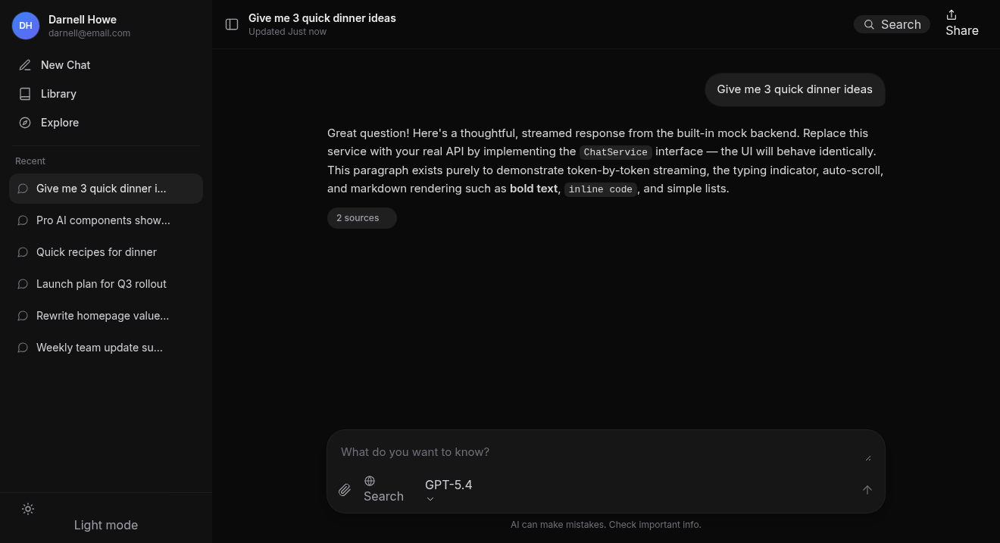
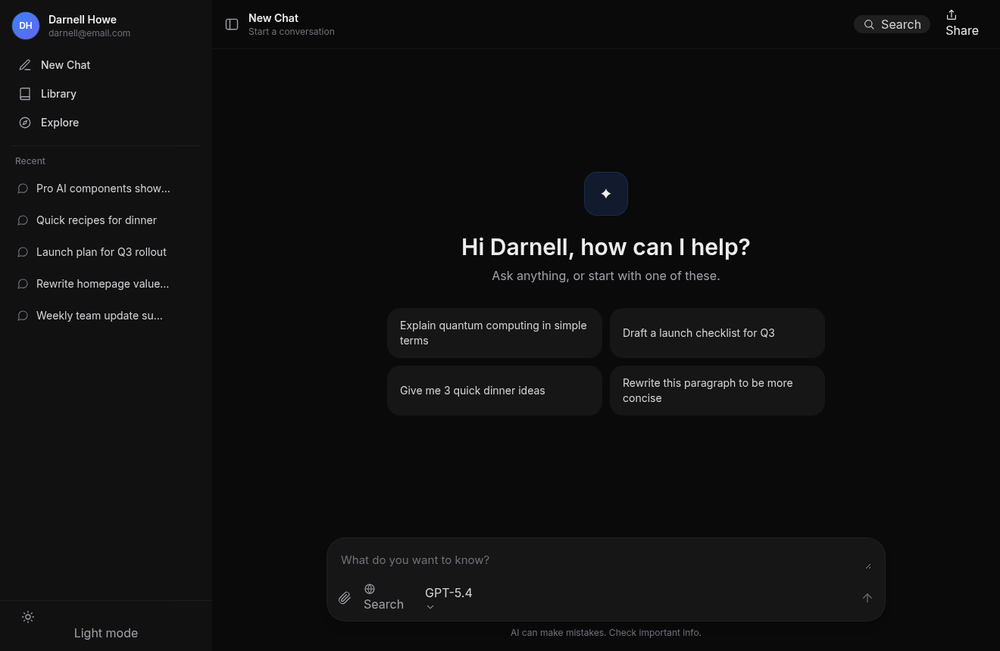

# Chatbot UI

A modern, **frontend-only** chatbot interface built with **Vite + React + TypeScript + [HeroUI](https://heroui.com/)**. It ships with a fully working in-memory mock backend so it runs with zero configuration, and it is architected so that **connecting a real backend touches only one file** and imposes **no endpoints, payload shapes, or provider on you**.

> **For the engineer/agent wiring up the backend:** read [`docs/BACKEND_INTEGRATION.md`](docs/BACKEND_INTEGRATION.md). It is a step-by-step guide. The short version: implement the `ChatService` interface (or edit the provided HTTP adapter) and flip one env var.





---

## Features

- 🎨 **Modern HeroUI design** — dark-first, fully theme-aware (light/dark toggle), responsive down to mobile with a drawer sidebar.
- 💬 **Streaming responses** — token-by-token rendering with a typing indicator and smart auto-scroll.
- 🧩 **Backend-agnostic** — the whole UI depends on a single `ChatService` interface. No endpoints or payloads are hard-coded into components.
- 🗂️ **Conversation management** — sidebar history, new chat, rename, delete (all optional on the backend side).
- 📎 **Attachments** — image previews + file chips, with an upload hook.
- 🔎 **Sources / citations** — collapsible "N sources" panel per assistant message.
- 🧠 **Model selector** — dropdown in the composer, driven by data from your backend.
- ✍️ **Lightweight markdown** — bold, italic, inline code, code blocks, headings, lists (swap for `react-markdown` if you need full GFM).
- 🛑 **Stop generation** — cancels the in-flight request via `AbortController`.
- 🧪 **Built-in mock backend** — realistic simulated streaming so you can develop the UI with no server.

---

## Quick start

```bash
# 1. Install
npm install

# 2. Run the dev server (uses the mock backend by default)
npm run dev
# → http://localhost:5173

# 3. Build for production
npm run build
npm run preview
```

That's it — no `.env` needed to see the UI working.

### Scripts

| Script | What it does |
| --- | --- |
| `npm run dev` | Start Vite dev server with HMR. |
| `npm run build` | Type-check (`tsc -b`) then build to `dist/`. |
| `npm run preview` | Serve the production build locally. |
| `npm run type-check` | Type-check without emitting (`tsc --noEmit`). |

---

## Connecting your backend (TL;DR)

1. Copy env: `cp .env.example .env`
2. In `.env` set:
   ```env
   VITE_CHAT_BACKEND=http
   VITE_API_BASE_URL=https://your-api.example.com
   ```
3. Open [`src/api/httpChatService.ts`](src/api/httpChatService.ts) and [`src/api/endpoints.ts`](src/api/endpoints.ts) and adjust the paths + payload mapping to match your API (search for `MAP:` comments).
4. Run `npm run dev`.

If your API differs a lot, implement the `ChatService` interface from scratch and register it in [`src/api/index.ts`](src/api/index.ts). **You never touch a React component to change backends.** Full details in [`docs/BACKEND_INTEGRATION.md`](docs/BACKEND_INTEGRATION.md).

---

## Architecture at a glance

```
UI components  ─►  ChatProvider (state + orchestration)  ─►  ChatService (interface)
   (dumb)              (src/store)                              │
                                                                ├─ MockChatService  (default)
                                                                └─ HttpChatService  (your API)
```

- **Components** (`src/components`) render state and call actions. They never import `fetch` or a URL.
- **`ChatProvider`** (`src/store`) owns all state via a reducer and performs side effects through the `ChatService` interface.
- **`ChatService`** (`src/api/ChatService.ts`) is the single contract a backend must satisfy. A factory (`src/api/index.ts`) picks the implementation from an env var.
- **Domain types** (`src/types`) are the shared vocabulary between UI and backend.

### Project structure

```
src/
├── api/
│   ├── ChatService.ts        # ⭐ The interface a backend must implement
│   ├── httpChatService.ts    # ⭐ Ready-to-edit HTTP adapter (real backends)
│   ├── mockChatService.ts    # In-memory fake backend (default)
│   ├── mockData.ts           # Seed data for the mock
│   ├── endpoints.ts          # Placeholder URL paths (rename to match your API)
│   └── index.ts              # Factory: chooses mock vs http from env
├── components/               # Presentational + container components
│   ├── Sidebar.tsx           #   profile, nav, recent conversations
│   ├── TopBar.tsx            #   title, search, share, sidebar toggle
│   ├── MessageList.tsx       #   scroll region + auto-scroll
│   ├── MessageBubble.tsx     #   one message (user pill / assistant prose)
│   ├── ChatInput.tsx         #   composer: text, attach, model, send/stop
│   ├── Sources.tsx           #   collapsible citations
│   ├── AttachmentChip.tsx    #   attachment preview
│   ├── EmptyState.tsx        #   new-chat greeting + starter prompts
│   ├── Markdown.tsx          #   tiny markdown renderer
│   └── icons.tsx             #   inline SVG icon set
├── config/
│   └── env.ts                # Typed access to VITE_* env vars
├── providers/
│   ├── AppProviders.tsx      # HeroUI + Theme + Chat providers
│   └── ThemeProvider.tsx     # dark/light management
├── store/
│   ├── ChatProvider.tsx      # ⭐ State + backend orchestration (useChat hook)
│   └── chatReducer.ts        # Reducer, actions, state shape
├── types/
│   └── index.ts              # ⭐ Domain model (Message, Conversation, …)
├── lib/format.ts             # time/byte/initials helpers
├── App.tsx                   # Layout
├── main.tsx                  # Entry
└── index.css                 # Tailwind + global styles
```

---

## Tech stack

| Concern | Choice | Notes |
| --- | --- | --- |
| Build tool | **Vite 6** | Fast HMR, `@/` path alias to `src`. |
| UI library | **HeroUI 2** | Components + theming; configured in `tailwind.config.js`. |
| Styling | **Tailwind CSS 3** | Dark-first, custom color tokens. |
| Animation | **Framer Motion** | Peer dependency of HeroUI. |
| Language | **TypeScript** (strict) | Shared domain types. |
| State | **React Context + useReducer** | No external store dependency. |

---

## Customization

- **Colors / theme:** edit the `heroui({ themes: … })` block in `tailwind.config.js`.
- **Starter prompts:** `src/components/EmptyState.tsx`.
- **Full markdown (tables, links, syntax highlight):** replace `src/components/Markdown.tsx` with `react-markdown` + `remark-gfm`.
- **Fonts:** the `Inter` font is loaded in `index.html`; swap the link or self-host for offline builds.

---

## License

MIT — do whatever you like.
